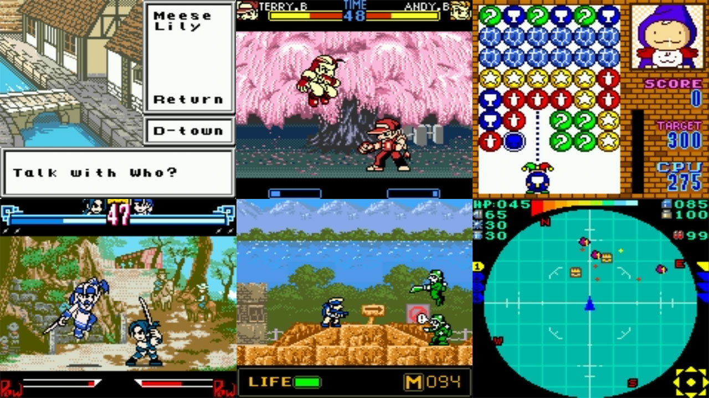

# SNK - Neo Geo CD (NeoCD)

### Description

NeoCD for libretro is complete rewrite of the NeoCD emulator in modern C++11.

### License

LGPLv3

### Icon

### Fanart

Help make me fanart!

### Screenshots

